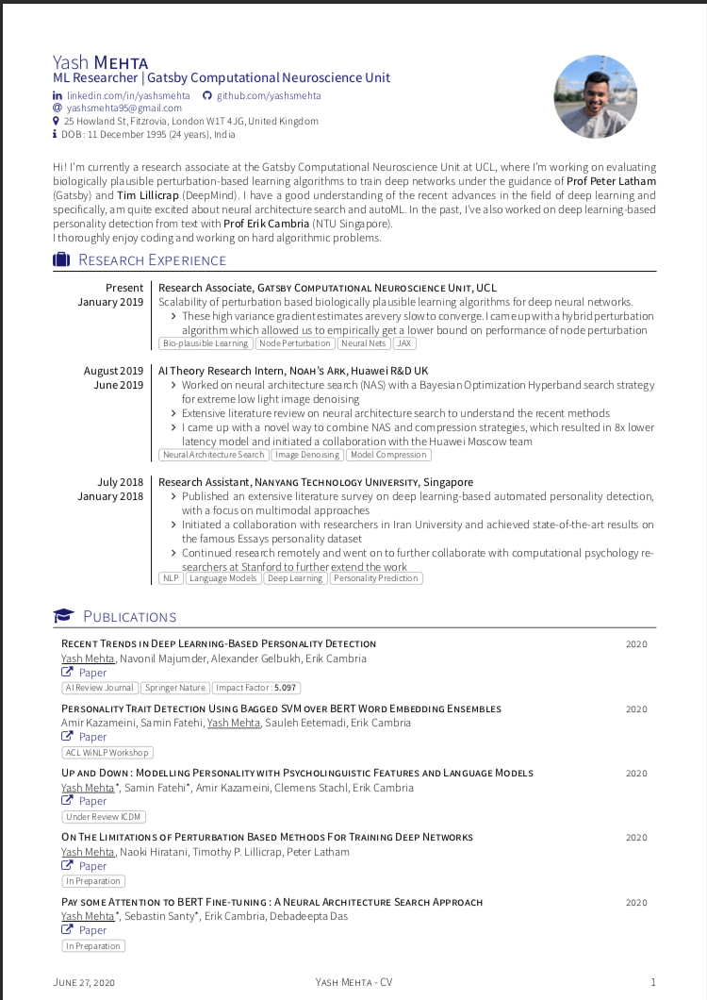

Academic Researcher CV
=================
## Motivation
Research or Academic CVs like  are often not very good looking and feel very clunky. By give a slight tint and using better fonts, the style and look of the CV can be made much better. 

This template is adapted from [Yet Another Awesome CV (YAAC)](https://github.com/darwiin/yaac-another-awesome-cv) and is an effort towards making academic/research CVs more cool looking.

The instructions are similar to YAAC.

## Preview
<!--  -->

## License

Latex class file _awesome-source-cv.cls_ is published under the term of the [LPPL Version 1.3c](https://www.latex-project.org/lppl.txt).

All content files are published under the term of the [CC BY-SA 4.0 License](https://creativecommons.org/licenses/by-sa/4.0/legalcode).
